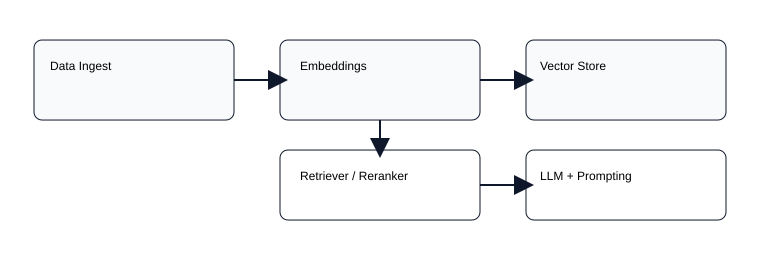
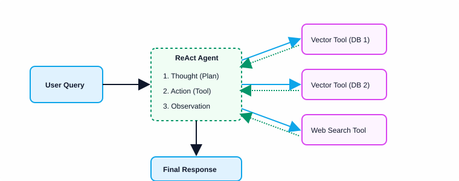

# 🤖 RAG & Agentic AI Masterclass — Udemy Course Project

[](https://www.python.org/downloads/)
[](https://jupyter.org/)
[](https://www.langchain.com/)
[](https://ollama.com/)
[](https://huggingface.co/)
[](https://openai.com/)
[](https://www.trychroma.com/)
[](https://www.pinecone.io/)

<div align="center">
  
</div>

This repository contains the code, Jupyter notebooks, datasets, and resources developed while following the comprehensive Udemy course on **Retrieval-Augmented Generation (RAG) and Agentic AI workflows** by Krish Naik.

🔗 **Course Link:** [Get the Course on Udemy](https://www.udemy.com/share/10dPvJ3@kD6XyQiiyT6MKv55-TXsXRvFhj_6velTAntGgbcQcQQGEa_m66tkowhJRv90yChCwg==/)

## 📖 Quick Summary

- **Purpose:** To master end-to-end modern RAG pipelines, from data ingestion to advanced agentic search.
- **Focus Areas:** Text/PDF/Database parsing, Semantic and Hybrid Search, Multimodal AI, LangChain, LangGraph, and ReAct Agents.
- **Tools Covered:** ChromaDB, FAISS, Pinecone, AstraDB, LangChain, LangGraph, HuggingFace, OpenAI, and Ollama (for local model inference).

<details>
<summary><b>📋 Table of Contents</b></summary>

- [Architecture & Workflow](#-architecture--workflow)
- [Project Structure & Modules](#-project-structure--modules)
- [Prerequisites](#-prerequisites)
- [Quick Start Guide](#-quick-start)
- [Running the Notebooks](#-running-the-notebooks)
- [Contributing](#-contributing)
- [License](#-license)

</details>

## 🏗 Architecture & Workflow

Here is a high-level representation of a typical RAG workflow covered in this repository:

<div align="center">
  
</div>

## 📂 Project Structure & Modules

The repository is organized progressively, starting from basic RAG concepts and scaling up to complex, multi-agent frameworks:

### 📥 1. Data Ingestion & Parsing (`DataIngestParsing/`)
- PDF, Word Doc, CSV, Excel, and JSON parsing.
- Connecting to external databases and structured file ingestion.

### 🧠 2. Embeddings & Vector Databases (`Embedding_and_vector_database/` & `Vector_Stores/`)
- Creating text embeddings and calculating similarity.
- Hands-on integration with **ChromaDB**, **FAISS**, **Pinecone**, and **DataStax AstraDB**.

### 🔍 3. Advanced Search Techniques (`SemanticSearch/` & `HybridSearchTechniques/`)
- Semantic Chunking.
- Dense & Sparse Retrieval, Hybrid Search, Reranking techniques, and Maximal Marginal Relevance (MMR).

### 🛠 4. Query Enhancements (`10_QuerryEnhancement/`)
- Query Expansion, Query Decomposition, and **HyDE** (Hypothetical Document Embeddings).

### 🖼️ 5. Multimodal RAG (`11_MultimodalRag/`)
- Implementing RAG over mixed media (Text + Images) using modern multimodal models.

### 🤖 6. AI Agents & LangChain Ecosystem (`12_AiAgents_n_AgenticAI/` & `13_Langchain_updated/`)
- Model integrations, Tool usage, Structured Outputs, and Route/Middleware handling in LangChain.

### 🕸️ 7. LangGraph Workflows (`14_Langgraph/`)
- Building stateful multi-actor applications, simple graphs, advanced chatbots with multiple tools, and managing State Schema using Pydantic.

### 🎭 8. Agent Patterns & Debugging (`15_Types_of_Agents/`)
- Exploring the **ReAct** (Reasoning + Acting) framework, streaming responses, and debugging agent traces.
- Using Python scripts directly alongside notebooks for pure code-based agentic workflows (`Debugging/agent.py`).

### 🚀 9. Agentic RAG (`16-AgenticRag/`)
- Combining agents with RAG pipelines.
- Building **Multi-Database RAG** systems where an agent dynamically routes queries to the best vector index.
- Complete execution of self-correcting RAG loops that query, verify context, and either regenerate responses or gather more data.

<div align="center">
  
  <br/>
  <em>An example of an Agentic RAG loop using a ReAct prompting strategy.</em>
</div>

---

## ⚙️ Prerequisites

Before you start, make sure you have the following installed:

1. **Python 3.8+** (We recommend using virtual environments).
2. **Git** for version control.
3. **Jupyter Lab** or **Jupyter Notebook**.
4. **API Keys:** Provide your own `OPENAI_API_KEY`, `HUGGINGFACEHUB_API_TOKEN`, etc., based on the notebook you are running.
5. **Ollama (Optional but Recommended):** For running local models like `llama3` or `mistral`.

## 🚀 Quick Start

Follow these steps to clone the repository and set up your local environment:

```bash
# 1. Clone the repository
git clone https://github.com/yourusername/Rag-Krish-naik.git
cd Rag-Krish-naik

# 2. Create and activate a virtual environment
python -m venv .venv
# On Windows:
source .venv/Scripts/activate
# On MacOS/Linux:
# source .venv/bin/activate

# 3. Install dependencies
pip install -r requirements.txt

# 4. Launch Jupyter Lab
jupyter lab
```

## 🏃 Running the Notebooks

1. Open `jupyter lab`.
2. Navigate to the desired module folder (e.g., `16-AgenticRag/`).
3. Click on the `.ipynb` file (e.g., `3-MultiDB_RAG.ipynb`).
4. Ensure your `.env` file is set up or API keys are injected in the leading cells.
5. Run the cells top-to-bottom.

> **Tip:** If a notebook utilizes Local LLMs via Ollama, make sure the Ollama server is running in your terminal (`ollama serve`).

## 🤝 Contributing

Contributions, issues, and feature requests are welcome!
- If you notice a broken notebook, feel free to open a Pull Request.
- Avoid committing large files like `chroma_db/`, `faiss_index/`, `.pdf`, or `__pycache__` folders. They are in the `.gitignore`.

## 📄 License

This repository is for educational purposes as part of the Udemy course training.

---
